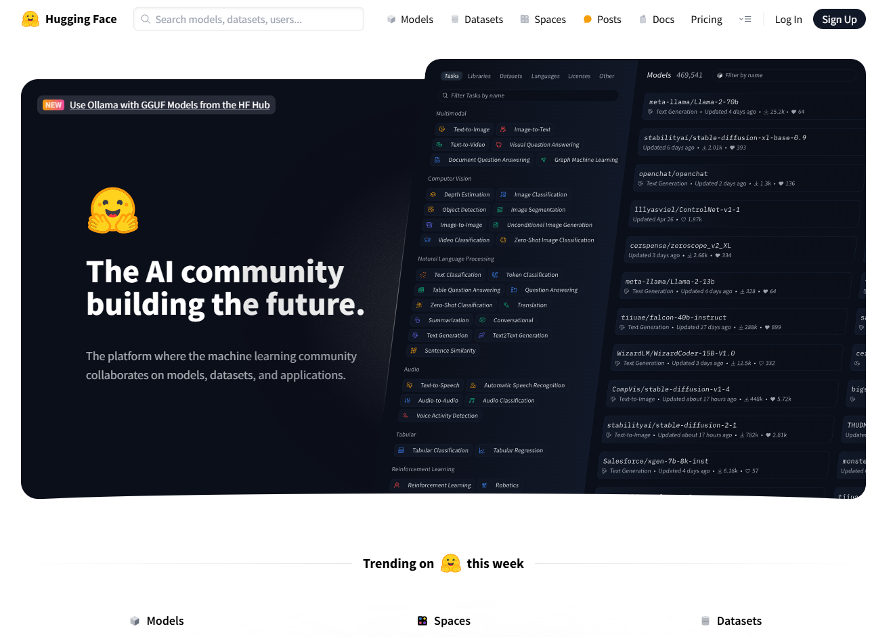
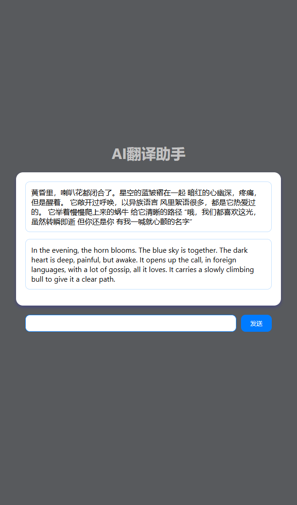
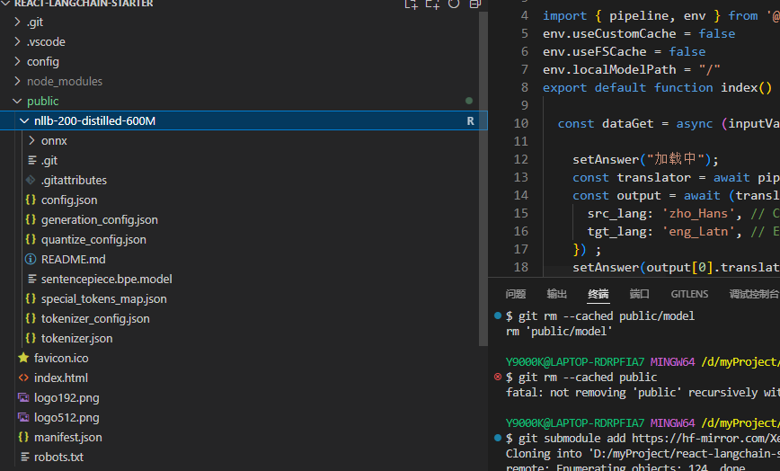

## 【纯前端】10 分钟带你用 langchainjs 做一个带RAG的AI医疗助手

首先介绍一下langchain，这个库是一个整合了ai模型各种的工具包。使用这个工具包，开发者能更专注于业务逻辑和业务实现。

然后讲一下RAG（Retrieval Augmented Generation），这个玩意叫做检索增强生成。目的是减少所谓的模型幻觉问题，即大模型胡说八道的情况，同时也能避免由于数据不及时或未更新而导致的答案不准确的问题

这个教程会用 医疗助手 作为一个类目 来做演示，目标是回答跟医疗相关的问题。代码地址在 https://github.com/electroluxcode/react-langchain-starter/    。有兴趣的朋友可以 clone 和 fork一下

先总览一下这个应用的流程吧，大体分成两个阶段

- 数据准备阶段：（1）数据获取和数据预处理–> （B）分块（Chunking） –> （C）向量化（embedding） –> （D）数据入库
- 检索生成阶段：（1）建立prompt–> （2）根据问题查询匹配数据(chain)–> （3）获取索引数据(chain) --> （4）将数据注入Prompt(chain)–> （5）LLM生成答案

另外，这篇文章讲的是用openai的第三方llm模型来做, 然后其他家的服务商模型其实也就差不多这样的。大家可以举一反三。

然后提前预告一下，接下来一篇文章，我会讲怎么用huggingface开源的模型来完成这种ai助手，支持离线调用和功能扩展，实现白嫖（bushi）。感兴趣的朋友可以关注我的github和掘金账号


### 前置准备资源

- node 的 环境: node 16 以上就行
- openai 的 key:由于众所皆知的原因，这个key申请可能会比较费事，因此可以用openai在国内的某些第三方代理

### 1.1 安装依赖


```
npm install langchain  @langchain/community @langchain/core @langchain/openai
```


### 1.2 数据获取


数据获取我们一般有三种情况。

- 获取网页数据：例如 Cheerio
- 从数据库中拿数据：不强依赖于langchain框架，例如：mysql
- 从数据集dataset中拿数据：例如：https://hf-mirror.com/

本文的采用第三种方法， 用 华佗数据集 来做数据源。大伙可以在这个网址下载。https://hf-mirror.com/datasets/nlp-guild/medical-data/tree/main


### 1.3 数据预处理


我们可以看到 这个数据集还是比较大的，然后也不是传统的json格式，而是

```
{}
{}
```

这样排列的。


因此我们针对这个数据集可以 这么做

- vscode之类的编辑器中，将`}` 替换成 `},` 。

- 前后加上[], 然后给他取一个变量名  `medicalData` ,更改`json`后缀成`js`后导出

- 删字符只到4，5行常用的数据(原因是心疼token[doge])

- 将数据做一个拼接

  ```js
  // 数据预处理
  const medicalStringHandle = medicalData.map((e) => {
        return `病名是${e.name}, 不要吃${e.not_eat}, 应该要检查 ${e.check} ,用药一般推荐${e.drug_detail.join(",")}`
  })
  ```

  

这些数据预处理根据你数据集的不同可以也可以有不同的变化，这主打一个灵活


### 1.4 定义分词器


```ts
import { RecursiveCharacterTextSplitter } from "@langchain/textsplitters";

const splitter = RecursiveCharacterTextSplitter.fromLanguage("html", {
    // 切分的最大长度
    chunkSize: 1000,
    // 相邻两个chunk之间的重叠token数量
    chunkOverlap: 20
})
let documents = []
for(let i of medicalStringHandle) {
    const tempDoc = await splitter.splitText(i)
    documents = [...documents, ...tempDoc]
}
console.log(documents)
```

这步是定义分词器，因为llm模型可能有一个maxtoken的限制，下面是`document`的输出示例


### 1.5  定义llm和embedding模型 

简单介绍一下 embedding 模型，这里我们利用预训练的模型（OpenAI 的语言模型）将文本转换为向量表示。向量表示是文本的高维数值表示，可以捕捉文本的语义信息，便于后续的相似性计算和检索任务。

```ts
import { OpenAIEmbeddings, ChatOpenAI } from "@langchain/openai";

const model = new ChatOpenAI({
    model: "gpt-3.5-turbo",
    openAIApiKey: "你的api key",
    configuration: {
        baseURL: "openai代理地址"
    }
});
let embeddings =  new OpenAIEmbeddings({
    openAIApiKey: "你的api key",
    configuration: {
        baseURL: "openai代理地址"
    }
    // modelName: "text-embedding-ada-002"
})
```


### 1.6 文本向量化存储


```ts
import { OpenAIEmbeddings, ChatOpenAI } from "@langchain/openai";

const vectorStore = await MemoryVectorStore.fromTexts(
    documents,[],
    embeddings
);
const vectorStoreRetriever = vectorStore.asRetriever();
```


### 1.7 构建prompt

```ts
import { ChatPromptTemplate } from "@langchain/core/prompts";
const SYSTEM_TEMPLATE = `使用上下文信息来回答最后的问题。如果你不知道答案，就直接说“我不知道”，不要试图编造答案。
----------------
{context}`;

const prompt = ChatPromptTemplate.fromMessages([
    ["system", SYSTEM_TEMPLATE],
    ["human", "{question}"],
]);
```


### 1.8 构造问答链


```ts
import { StringOutputParser } from "@langchain/core/output_parsers";
import {
  RunnablePassthrough,
  RunnableSequence,
} from "@langchain/core/runnables";
const formatDocumentsAsString = (documents: any[]) => {
  return documents.map((document) => document.pageContent).join("\n");
};
const chain = RunnableSequence.from([
    {
        context: vectorStoreRetriever.pipe(formatDocumentsAsString),
        question: new RunnablePassthrough(),
    },
    prompt,
    model,
    new StringOutputParser(),
]);

```


### 1.9   调用llm模型进行输出

```ts
 let quesion =  "肺转移瘤要怎么用药"
 const answer = await chain.invoke(
     quesion
 );

console.log({ quesion,answer,documents,embeddings });
```


我们可以跟源数据进行比较，验证`drug_detail` 确实跟我们的 `answer` 相匹配。至此其实基本的流程已经跑通了。总代码100行不到。

如果要应用到工程化的话，可能也就是加一个向量存储，然后维护一下数据的交互

url:http://localhost:3002/WebRagOnlineEasy

文件地址: src\views\WebRagOnlineEasy\index.tsx


### 1.10 简单构造ui


最后简单构造一下ui把，是前端的基操了，不赘述，有兴趣的可以看看

url:http://localhost:3002/WebRagOnline

文件地址: src\views\WebRagOnline\index.tsx


## 纯前端怎么离线调用huggingface 1000+多个大模型。以30行代码实现一个翻译助手示例


大家好，我是electrolux，这篇文章带大家看看前端怎么直接离线调用huggingface的模型

代码在这里: https://github.com/electroluxcode/react-langchain-starter

路由是: /transformer

在开始文章之前。首先咱们来聊一下huggingface吧




简单的来说huggingface 可以理解为对于AI开发者的GitHub，提供了模型，数据集等ai的物料。并且提供了一个名为 **transformers** 的库，这个库结合了多种模型，使得用户可以快速地学习和使用这些模型

然后回归咱们的文章，咱们这篇文章也会用到 transformerjs， 这个库也是 官方提供的库，对比transformer其他服务端的package，主要少了视频的输出能力和表格任务。具体可以参考 https://hugging-face.cn/docs/transformers.js/index#tasks

这篇文章会用 transformerjs 用 30行代码左右带你实现一个ai翻译助手，下面是成品，接着预告一下，下一篇文章我会用langchan+transformerjs实现一个带rag(目标检索增强)的llm助手，有兴趣的可以follow一下。话不多说，直接开始





### 1.1  选择模型和下载模型 

说实话，这一步可能就是咱们这个教程最难的地方了，由于众所皆知的原因，咱们不能直接连接huggingface，所以这一步我们可以选择他的镜像站点

https://hf-mirror.com/

现在是第二步，我们要清楚前端不是每一个模型都能够直接调用的，只有是onnx的格式才能够进行调用，因此  我们可以在hf中搜两个作者。 onnx-community 和 Xenova 。这两者的模型可以直接在前端调用。

地址如下 

- https://hf-mirror.com/Xenova
- https://hf-mirror.com/onnx-community


好，现在我们到第三步了，怎么把模型下载到我们本地。在前端项目中，public文件夹一般是可访问的。我们可以考虑将大模型下载到这里。由于文件较大，这里提供三个方法下载。在咱们的源码示例中，也不会携带模型的

- submodule方法

```shell
git submodule add https://hf-mirror.com/Xenova/nllb-200-distilled-600M public/nllb-200-distilled-600M
# 后续可能需要 git lfs pull
```

- 直接在 public 文件夹中 git clone，然后大文件直接去镜像站下载就好了
- 也可以直接下载模型到一个可以访问的地址


我的目录结构如下




### 1.2  指定环境变量

这一步是离线调用的关键，默认`transformer` 是 会加载 `huggingface` 的模型，我们可以通过改变环境变量来让前端去加载自己本地的模型


```js
import { env } from '@xenova/transformers';
env.useCustomCache = false
env.useFSCache = false
// 会加载
env.localModelPath = "/"
```


### 1.3  调用模型输出

transformer核心是一个 pipeline 方法，然后 在 https://hf-mirror.com/Xenova/nllb-200-distilled-600M#usage-transformersjs 中 也有这个模型的使用示例

```ts
import { pipeline } from '@xenova/transformers';
let dataGet = async () => {
    const translator = await pipeline('translation', 'nllb-200-distilled-600M');
    let input = '你好,今天天气怎么样'
    const output = await translator(input, {
        src_lang: 'zho_Hans', // Chinese
        tgt_lang: 'eng_Latn', // English
    });
    console.log({
        output, input
    });
}
dataGet();
```


完整代码如下，26行代码就实现了，aw。确实简单。然后就在控制台中输出了

```ts
import React from 'react'
import { useEffect } from 'react'
import { pipeline, env } from '@xenova/transformers';
env.useCustomCache = false
env.useFSCache = false
env.localModelPath = "/model"
export default function index() {
    let dataGet = async () => {
        const translator = await pipeline('translation', 'nllb-200-distilled-600M');
        let input = '你好,今天天气怎么样'
        const output = await translator(input, {
            src_lang: 'zho_Hans', // Chinese
            tgt_lang: 'eng_Latn', // English
        });
        console.log({
            output, input
        });
    }
    useEffect(() => {
        dataGet();
    })
    return (
        <div>transformer</div>
    )
}

```


### 1.4 代码简单加个ui


结果见这个


css文件

```css
body {
  margin: 0;
  font-family: -apple-system, BlinkMacSystemFont, 'Segoe UI', 'Roboto', 'Oxygen',
    'Ubuntu', 'Cantarell', 'Fira Sans', 'Droid Sans', 'Helvetica Neue',
    sans-serif;
  -webkit-font-smoothing: antialiased;
  -moz-osx-font-smoothing: grayscale;
}

.bg-black{
  background-color: #000;
}

.bg-blue-1{
  background-color: #e6f2ff;
}

.bg-blue-3{
  background-color: #007bff;
}
.bg-white{
  background-color: #fff;
}

.bg-black-1{
  background: #585a5d
}

.color-white-1{
  color: #c3c3c3
}


.color-blue-1{
  color: #a6d2ff;
}
.color-blue-3{
  color: #007bff;
}
.color-white{
  color: #fff;
}

.chat-container {
  display: flex;
  flex-direction: column;
  align-items: center;
  justify-content: center;
  height: 100vh;
  
 
}
.chat-move{
  position: relative;
  top: -100px;
  width: 100%;
  height: 100%;
  display: flex;
  flex-direction: column;
  align-items: center;
  justify-content: center;
}
.messages-container {
  width: 80%;
  max-height: 60%;
  overflow-y: auto;
  padding: 20px;
  border-radius: 15px;
  box-shadow: 0 4px 8px rgba(0, 0, 255, 0.2);
}

.message {
  padding: 12px;
  border-radius: 10px;
  margin-bottom: 15px;
  word-break: break-word;
}

.user {
  border: 1px solid #c2e0ff;
  align-self: flex-end;
}

.bot {
  border: 1px solid #c2e0ff;
  display: flex;
  flex-direction: row-reverse;
  align-self: flex-start;
}

.input-area {
  display: flex;
  gap: 10px;
  width: 80%;
  margin-top: 20px;
}

input {
  flex-grow: 1;
  border: 1px solid #007bff;
  border-radius: 10px;
}
input:focus {
  outline: none;
  border: 1px solid #007bff;
}

button {
  padding: 10px 20px;
  border: none;
  border-radius: 10px;
  cursor: pointer;
}
```


tsx文件示例，路由在  /Transformer

```tsx
import React from 'react'
import { useState} from 'react'

import { pipeline, env } from '@xenova/transformers';
env.useCustomCache = false
env.useFSCache = false
env.localModelPath = "/"
export default function index() {

  const dataGet = async (inputValueTemp) => {
    
    setAnswer("加载中");
    const translator = await pipeline('translation', 'nllb-200-distilled-600M');
    const output = await (translator as any)(inputValueTemp, {
      src_lang: 'zho_Hans', // Chinese
      tgt_lang: 'eng_Latn', // English
    }) ;
    setAnswer(output[0].translation_text);
  }
  const [quesion, setQuestion] = useState('提问区');
  const [answer, setAnswer] = useState('回答区');
  const [inputValue, setInputValue] = useState('');

  const handleSendMessage = () => {
    if (inputValue.trim() !== '') {
      setQuestion(inputValue)
      setInputValue('');
      dataGet(inputValue)
    }
  };

  return (
    <div className="chat-container bg-black-1">
      <div className="chat-move">
        <div className="title">
          <h1 className='color-white-1'>AI翻译助手</h1>
        </div>
        <div className="messages-container bg-white">
          <div
            className="message user"
          >
            {quesion}
          </div>
          <div
            className="message bot"
          >
            {answer}
          </div>
        </div>
        <div className="input-area">
          <input
            type="text"
            value={inputValue}
            onChange={(e) => setInputValue(e.target.value)}
          />
          <button className='bg-blue-3 color-white' onClick={handleSendMessage}>发送</button>
        </div>
      </div>
    </div>
  );
}

```


### 1.5  感叹一下

transformerjs确实是个好框架，可惜的是transformerjs并不支持训练，虽然也没几个会在客户端进行训练哈哈。

并且现在如果要web端加载几个g的模型对性能是个大挑战

因此这个玩意工程化之路道阻且长, 但是我相信也不会有多久的，

目前唯一感觉可以使用的场景是在手机端，可以模仿王者荣耀资源包的形式引入模型，让用户自主选择。

顺便一提，最近看 到一个 MobileLLM(Optimizing Sub-billion Parameter Language Models for On-Device Use Cases)，算是近期优化的比较好的一个开源模型，是为了移动端性能考虑的量化模型，但是文件堪堪也有800M，虽然也挺大的，但是在动则3，4G的模型中算还可以

- paper:https://arxiv.org/pdf/2402.14905
- code: https://github.com/facebookresearch/MobileLLM
- example：https://github.com/huggingface/transformers.js/pull/1003

