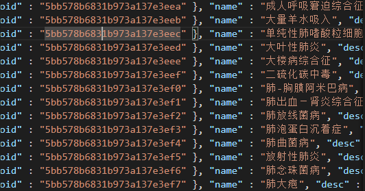
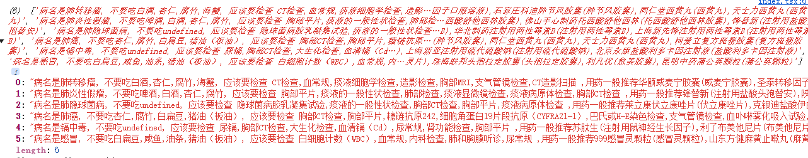
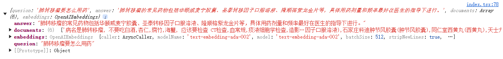
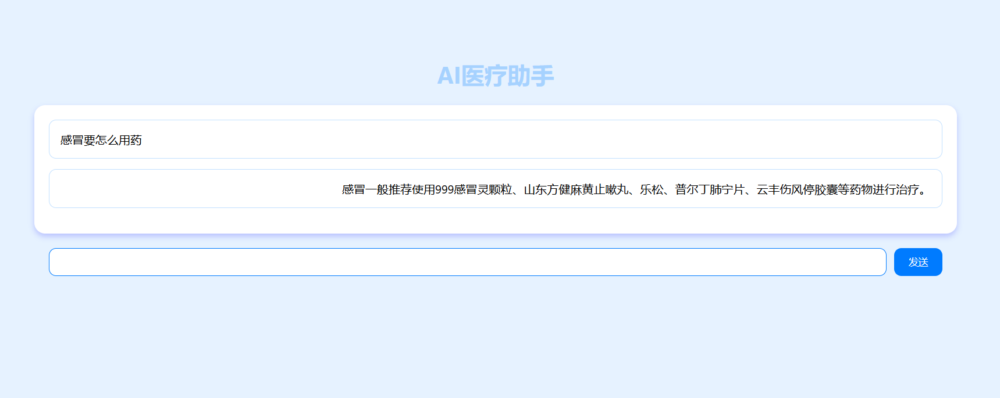

## 【纯前端】10 分钟带你用 langchainjs 做一个带RAG的AI医疗助手

首先介绍一下langchain，这个库是一个整合了ai模型各种的工具包。使用这个工具包，开发者能更专注于业务逻辑和业务实现。

然后讲一下RAG（Retrieval Augmented Generation），这个玩意叫做检索增强生成。目的是减少所谓的模型幻觉问题，即大模型胡说八道的情况，同时也能避免由于数据不及时或未更新而导致的答案不准确的问题

这个教程会用 医疗助手 作为一个类目 来做演示，目标是回答跟医疗相关的问题。代码地址在 https://github.com/electroluxcode/react-langchain-starter/    。有兴趣的朋友可以 clone 和 fork一下

先总览一下这个应用的流程吧，大体分成两个阶段

- 数据准备阶段：（1）数据获取和数据预处理–> （B）分块（Chunking） –> （C）向量化（embedding） –> （D）数据入库
- 检索生成阶段：（1）建立prompt–> （2）根据问题查询匹配数据(chain)–> （3）获取索引数据(chain) --> （4）将数据注入Prompt(chain)–> （5）LLM生成答案

另外，这篇文章讲的是用openai的第三方llm模型来做, 然后其他家的服务商模型其实也就差不多这样的。大家可以举一反三。

然后提前预告一下，接下来一篇文章，我会讲怎么用huggingface开源的模型来完成这种ai助手，支持离线调用和功能扩展，实现白嫖（bushi）。感兴趣的朋友可以关注我的github和掘金账号


### 前置准备资源

- node 的 环境: node 16 以上就行
- openai 的 key:由于众所皆知的原因，这个key申请可能会比较费事，因此可以用openai在国内的某些第三方代理

### 1.1 安装依赖


```
npm install langchain  @langchain/community @langchain/core @langchain/openai
```


### 1.2 数据获取


数据获取我们一般有三种情况。

- 获取网页数据：例如 Cheerio
- 从数据库中拿数据：不强依赖于langchain框架，例如：mysql
- 从数据集dataset中拿数据：例如：https://hf-mirror.com/

本文的采用第三种方法， 用 华佗数据集 来做数据源。大伙可以在这个网址下载。https://hf-mirror.com/datasets/nlp-guild/medical-data/tree/main


### 1.3 数据预处理


我们可以看到 这个数据集还是比较大的，然后也不是传统的json格式，而是

```
{}
{}
```

这样排列的。




因此我们针对这个数据集可以 这么做

- vscode之类的编辑器中，将`}` 替换成 `},` 。

- 前后加上[], 然后给他取一个变量名  `medicalData` ,更改`json`后缀成`js`后导出

- 删字符只到4，5行常用的数据(原因是心疼token[doge])

- 将数据做一个拼接

  ```js
  // 数据预处理
  const medicalStringHandle = medicalData.map((e) => {
        return `病名是${e.name}, 不要吃${e.not_eat}, 应该要检查 ${e.check} ,用药一般推荐${e.drug_detail.join(",")}`
  })
  ```

  

这些数据预处理根据你数据集的不同可以也可以有不同的变化，这主打一个灵活


### 1.4 定义分词器


```ts
import { RecursiveCharacterTextSplitter } from "@langchain/textsplitters";

const splitter = RecursiveCharacterTextSplitter.fromLanguage("html", {
    // 切分的最大长度
    chunkSize: 1000,
    // 相邻两个chunk之间的重叠token数量
    chunkOverlap: 20
})
let documents = []
for(let i of medicalStringHandle) {
    const tempDoc = await splitter.splitText(i)
    documents = [...documents, ...tempDoc]
}
console.log(documents)
```

这步是定义分词器，因为llm模型可能有一个maxtoken的限制，下面是`document`的输出示例




### 1.5  定义llm和embedding模型 

简单介绍一下 embedding 模型，这里我们利用预训练的模型（OpenAI 的语言模型）将文本转换为向量表示。向量表示是文本的高维数值表示，可以捕捉文本的语义信息，便于后续的相似性计算和检索任务。

```ts
import { OpenAIEmbeddings, ChatOpenAI } from "@langchain/openai";

const model = new ChatOpenAI({
    model: "gpt-3.5-turbo",
    openAIApiKey: "你的api key",
    configuration: {
        baseURL: "openai代理地址"
    }
});
let embeddings =  new OpenAIEmbeddings({
    openAIApiKey: "你的api key",
    configuration: {
        baseURL: "openai代理地址"
    }
    // modelName: "text-embedding-ada-002"
})
```


### 1.6 文本向量化存储


```ts
import { OpenAIEmbeddings, ChatOpenAI } from "@langchain/openai";

const vectorStore = await MemoryVectorStore.fromTexts(
    documents,[],
    embeddings
);
const vectorStoreRetriever = vectorStore.asRetriever();
```


### 1.7 构建prompt

```ts
import { ChatPromptTemplate } from "@langchain/core/prompts";
const SYSTEM_TEMPLATE = `使用上下文信息来回答最后的问题。如果你不知道答案，就直接说“我不知道”，不要试图编造答案。
----------------
{context}`;

const prompt = ChatPromptTemplate.fromMessages([
    ["system", SYSTEM_TEMPLATE],
    ["human", "{question}"],
]);
```


### 1.8 构造问答链


```ts
import { StringOutputParser } from "@langchain/core/output_parsers";
import {
  RunnablePassthrough,
  RunnableSequence,
} from "@langchain/core/runnables";
const formatDocumentsAsString = (documents: any[]) => {
  return documents.map((document) => document.pageContent).join("\n");
};
const chain = RunnableSequence.from([
    {
        context: vectorStoreRetriever.pipe(formatDocumentsAsString),
        question: new RunnablePassthrough(),
    },
    prompt,
    model,
    new StringOutputParser(),
]);

```


### 1.9   调用llm模型进行输出

```ts
 let quesion =  "肺转移瘤要怎么用药"
 const answer = await chain.invoke(
     quesion
 );

console.log({ quesion,answer,documents,embeddings });
```





我们可以跟源数据进行比较，验证`drug_detail` 确实跟我们的 `answer` 相匹配。至此其实基本的流程已经跑通了。总代码100行不到。

如果要应用到工程化的话，可能也就是加一个向量存储，然后维护一下数据的交互

url:http://localhost:3002/WebRagOnlineEasy

文件地址: src\views\WebRagOnlineEasy\index.tsx


### 1.10 简单构造ui


最后简单构造一下ui把，是前端的基操了，不赘述，有兴趣的可以看看

url:http://localhost:3002/WebRagOnline

文件地址: src\views\WebRagOnline\index.tsx





## 【纯前端】10 分钟带你用 langchainjs 做一个带RAG的AI医疗助手(离线白嫖版本)


工作搬砖中，有时间续写。大纲是怎么调用开源模型实现上面的效果...................
